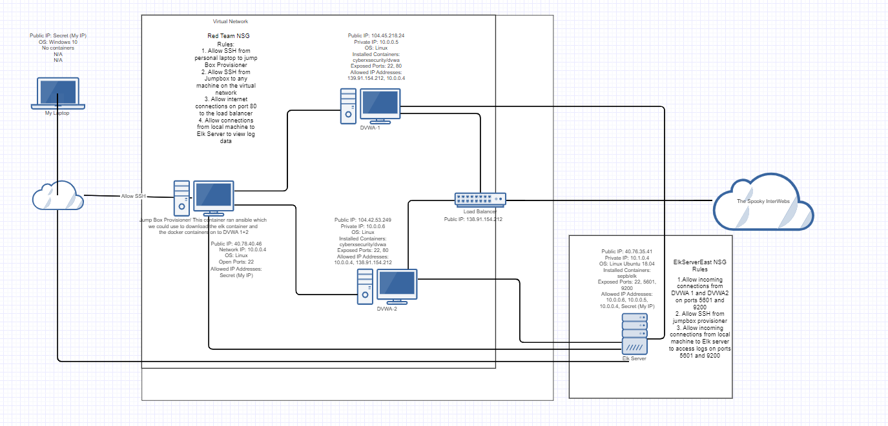
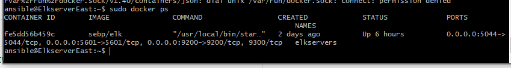

## Automated ELK Stack Deployment

The files in this repository were used to configure the network depicted below.

These files have been tested and used to generate a live ELK deployment on Azure. They can be used to either recreate the entire deployment pictured above. Alternatively, select portions of the elk-install.yaml file may be used to install only certain pieces of it, such as Filebeat.

  - _TODO: Enter the playbook file._
  elk-install.yaml

This document contains the following details:
- Description of the Topology
- Access Policies
- ELK Configuration
  - Beats in Use
  - Machines Being Monitored
- How to Use the Ansible Build

### Description of the Topology

The main purpose of this network is to expose a load-balanced and monitored instance of DVWA, the D*mn Vulnerable Web Application.
Load balancing ensures that the application will be highly distributed, in addition to restricting access to the network.
- _TODO: What aspect of security do load balancers protect? What is the advantage of a jump box?_

Load balancers ensure that there is a lesser chance of a DoS or DDoS (aka they protect the availablity of data). It does this by making sure each machine in the system is receiving an equal amount of traffic. This makes sure neither machine gets overwhelmed and thus, won't stop responding to users. Without a load balancer this type of issue can become very common. 

The advantage of having a jump-box is that it can ensure that the only person who has access to the network is someone who has access to said jumpbox. It also adds an extra layer of security rather than giving someone direct access to the network with their personal machine.

Integrating an ELK server allows users to easily monitor the vulnerable VMs for changes to the file systems and system logs.
- _TODO: What does Filebeat watch for?_
We installed filebeat which is used to forward and centralize log data. It monitors the log files or locations that you specify, collects log events, and forwards them either to Elasiticsearch or Logstash for indexing. 
- _TODO: What does Metricbeat record?_
Metric beat collects metrics from the OS on certain systems which can help in reviewing the amount of activity or use those machines are receiving over time. In this way it helps you visualize the usage of the application. 

The configuration details of each machine may be found below.
_Note: Use the [Markdown Table Generator](http://www.tablesgenerator.com/markdown_tables) to add/remove values from the table_.

| Name       | Function   | IP Address | Operating System |
|----------  |----------  |------------|------------------|
| Jump Box   | Gateway    | 10.0.0.4   | Linux            |
| DVWA-1     | Web App    | 10.0.0.5   | Linux            |
| DVWA-2     | Web App    | 10.0.0.6   | Linux            |
| Elk Server | Log Server | 10.0.0.8   | Linux            |

### Access Policies

The machines on the internal network are not exposed to the public Internet. 

Only the load balancer can accept connections from the Internet. Access to this machine is only allowed from the following IP addresses:
- My personal IP
- load balancer: 138.91.154.212

Machines within the network can only be accessed by the jump-box provisioner.
- Jump-Box-provisioner: 40.78.40.46 (public) 10.0.0.4 (private)

A summary of the access policies in place can be found in the table below.

| Name          | Publicly Accessible | Allowed IP Addresses                              |
|---------------|---------------------|---------------------------------------------------|
| Jump Box      |  Yes                | My Local IP                                       |
| Load Balancer |  Yes                | 138.91.154.212                                    |
| DVMA-1        |  No                 |   10.0.0.4                                        |
| DVMA-2        |  No                 |   10.0.0.4                                        |
| Elk Server    |  No                 |   [40.78.40.46, 10.0.0.4] 10.0.0.5, 10.0.0.6      |

### Elk Configuration

Ansible was used to automate configuration of the ELK machine. No configuration was performed manually, which is advantageous because...
- _TODO: What is the main advantage of automating configuration with Ansible?_
The main advantage of automating configuration with Ansible is that rather than having to go from the jump box to every machine on the network, you can run one program from the jump box and it will install and configure all of the necessary machines on the network. 

The playbook implements the following tasks:
- _TODO: In 3-5 bullets, explain the steps of the ELK installation play. E.g., install Docker; download image; etc._
- ... 1. The install-elk.yml file first installs docker
- ... 2. Installs a python package manager called pip
- ... 3. Installs a Docker python module
- ... 4. Expands the virtual memory of the Elk Server (essentially gives the server more ram to handle processing)
- ... 5. Download and luanch the docker web container

The following screenshot displays the result of running `docker ps` after successfully configuring the ELK instance.

### Target Machines & Beats
This ELK server is configured to monitor the following machines:
- _TODO: List the IP addresses of the machines you are monitoring_
-... 10.0.0.5
-... 10.0.0.6

We have installed the following Beats on these machines:
- _TODO: Specify which Beats you successfully installed_
-...filebeat

These Beats allow us to collect the following information from each machine:
- _TODO: In 1-2 sentences, explain what kind of data each beat collects, and provide 1 example of what you expect to see. E.g., `Winlogbeat` collects Windows logs, which we use to track user logon events, etc._
Filebeat is currently being used to track Syslogs, users who are running sudo commands, SSH logins, as well as whenever new users and groups are created. 

### Using the Playbook
In order to use the playbook, you will need to have an Ansible control node already configured. Assuming you have such a control node provisioned: 

SSH into the control node and follow the steps below:
- Copy the install-elk.yml file to the /etc/ansible/ directory on your ansible node machine (where ansible container is running).
- Update the install-elk.yml file to reflect the hosts you would like to be affected by the ansible playbook (in this example, our host was called [elkservers] within the ansible hosts file)
- Run the playbook (ansible-playbook install-elk.yml), and navigate to [your_elkserver_ip]:5601 to check that the installation worked as expected.

_TODO: Answer the following questions to fill in the blanks:_
- _Which file is the playbook? Where do you copy it?_
- _Which file do you update to make Ansible run the playbook on a specific machine? How do I specify which machine to install the ELK server on versus which to install Filebeat on?_
- _Which URL do you navigate to in order to check that the ELK server is running?_

_As a **Bonus**, provide the specific commands the user will need to run to download the playbook, update the files, etc._